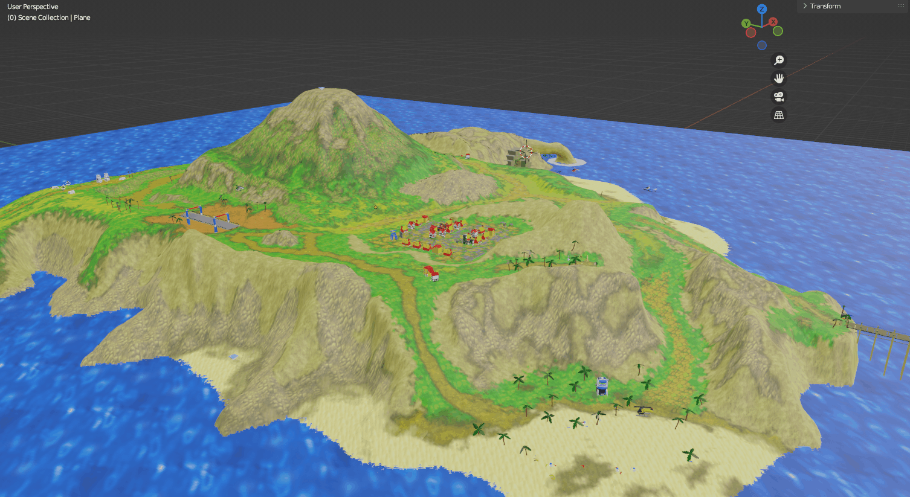
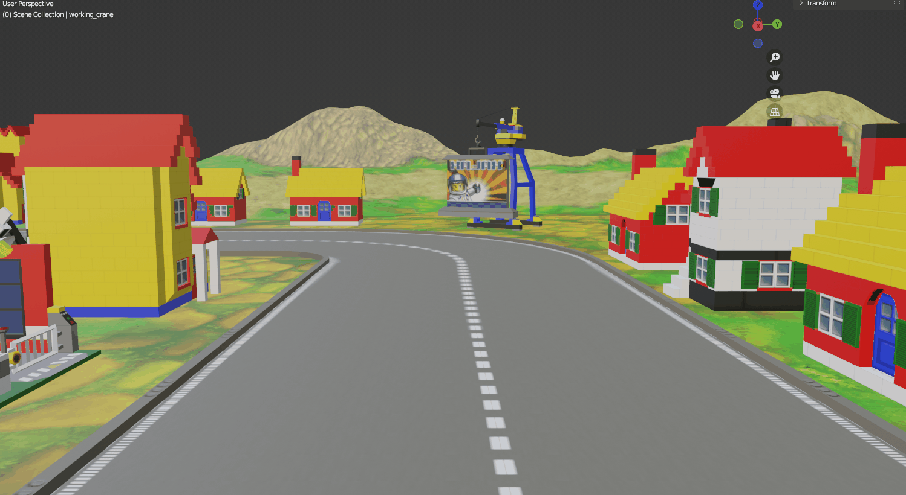
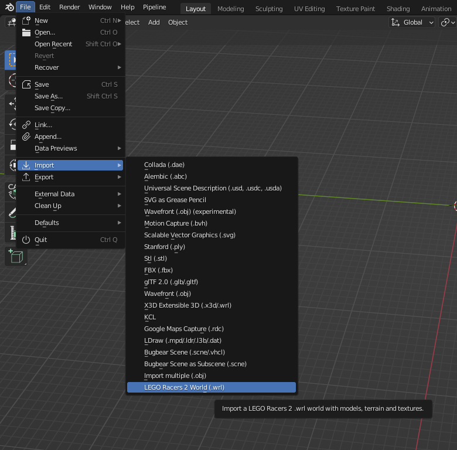
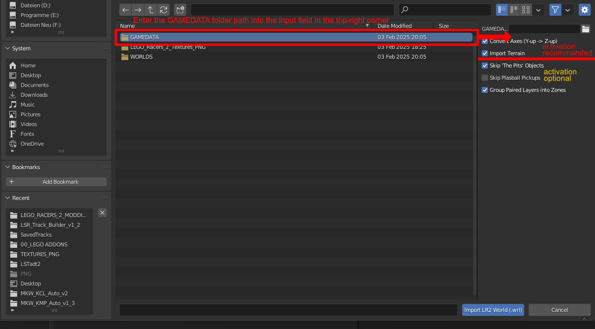

# LEGO Racers 2 World Importer for Blender

A Blender addon that imports **LEGO Racers 2** (2001) `.wrl` world files
directly into Blender — models, terrain (with multi-texture blending), and
textures — reverse-engineered from the game's proprietary binary formats.

No intermediate `.obj`/`.mtl`/`.png` files are produced: meshes, materials
and images are built natively in Blender via `bmesh` and the shader node
system.





## Features

- Parses `.wrl` world files (entity container format) and places every
  referenced object at its correct position, rotation and scale.
- Imports `.md2` (MDL2) models with vertex normals, UVs and material colors.
- Imports terrain (`TERRDATA.TDF`) as a single mesh with real multi-texture
  blending (up to 4 layers per vertex, matching the original terrain
  shader's weighting).
- Decodes the game's `.MIP` textures natively in Python (no external image
  library required) — `.MIP` files turned out to be the classic Truevision
  TGA format under a different extension.
- Alpha/transparency handling that follows the original engine's per-material
  `alpha_type` (cutout / soft blend / additive-approximated), instead of a
  one-size-fits-all transparency mode.
- Organizes imported objects into Collections by the WRL's `layer` field,
  with an option to further group layer pairs that share a "zone" (layers
  differing by bit `0x200000`) under a common parent Collection.
- Resolves the WRL's `binding` cross-references into real Blender parent/child
  relationships (e.g. checkpoint decorations parented to their checkpoint).
- Per-import options to skip specific entity types/objects (e.g. `cThePits`,
  `plasball` pickups).


## Requirements

- Blender 3.2 or later (developed and tested on **3.2**; later 3.x and 4.x
  versions should theoretically work but have not been verified).
- A legally owned copy of LEGO Racers 2, with its `GAMEDATA.GTC` archive
  already extracted (e.g. via [UNGTC](https://github.com/JrMasterModelBuilder/UNGTC))
  into a folder on disk.

## Installation

1. Download `lr2_import_addon.py` from this repository.
2. In Blender: **Edit → Preferences → Add-ons → Install...**, select the file.
3. Enable the checkbox next to "LEGO Racers 2 World Importer".

## Usage

**File → Import → LEGO Racers 2 World (.wrl)**, then pick a `.wrl` file
(typically under `GAMEDATA\...\SAVED WORLDS\`).



In the import options panel (bottom-left of the file browser), set:


| Option                             | Description                                                                                                 |
| ---------------------------------- | ----------------------------------------------------------------------------------------------------------- |
| **GAMEDATA Folder**                | Root of your extracted game data. Required.                                                                 |
| **Convert Axes**                   | Converts LR2's Y-up coordinate system to Blender's Z-up. Leave on unless you have a specific reason not to. |
| **Import Terrain**                 | Also imports the level's terrain heightmap.                                                                 |
| **Skip 'The Pits' Objects**        | Excludes `cThePits` entities.                                                                               |
| **Skip Plasball Pickups**          | Excludes weapon pickup objects named "plasball".                                                            |
| **Group Paired Layers into Zones** | Nests `Layer_<n>` collections that appear to share a route/zone under a common `Zone_<n>` collection.       |





## How it works (short version)

- `.wrl` files are a binary entity container (not VRML, despite the
  extension) — a sequence of typed chunks, each with common fields
  (`layer`, `name`) plus type-specific fields (position, rotation, scale,
  a `binding` cross-reference, and for most types a `model` reference).
- `.md2` model files are a custom chunked format (`MDL1`/`MDL2` header +
  `GEO1` geometry chunk), unrelated to id Software's Quake II MD2 format
  despite sharing a name and extension.
- `TERRDATA.TDF` stores a 32×32 grid of terrain chunks, each with a
  16-bit height, an 8-bit packed normal, and a 16-bit `mix_ratios` field
  whose four nibbles are the blend weights for up to four textures.
- `.MIP` texture files are byte-for-byte the classic Truevision TGA format,
  just renamed. Supported subset: uncompressed types 1 (paletted) and 2
  (true-colour), 24 or 32 bit.

## Known limitations

- **Terrain texture filenames are assumed to be `TEXTURE<index+1>.MIP`**
  (0-based index in the file, 1-based filename) — confirmed against the
  Whirled source, but if a level uses a different naming convention for
  its terrain textures this will fail to resolve them.
- **Models use only their first (dominant) texture layer** — MDL2 render
  groups support up to 4 blended texture layers like terrain does, but
  this addon currently only samples the first one. Terrain, which needed
  real blending to look right, does implement the full 4-layer blend.
- **`alpha_type == 4` (additive blending)** is approximated with regular
  alpha blending, since Blender's classic EEVEE material system has no
  direct equivalent to Godot's additive blend mode used as the reference.
- **Zone/route grouping (paired layer values differing by `0x200000`) is an
  empirically observed pattern**, not a documented/confirmed format
  feature — it held up consistently across everything tested, but treat it
  as a heuristic.
- **`binding` cross-references are resolved by exact name match** and
  assume names are unique within a given `.wrl` file.

## Credits & sources

This addon builds on the work of several people who reverse-engineered
LEGO Racers 2's file formats before this project existed:

- **[GiantBlargg](https://github.com/GiantBlargg)** — author of
  [Whirled](https://github.com/GiantBlargg/Whirled), a Godot-based LR2
  viewer whose C++ source (`wrl.cpp`, `wrl_formats.cpp`, `mdl2.cpp`,
  `tdf.cpp`, among others) documents the WRL, MDL2 and TDF formats in
  detail. The corresponding parsing logic in this addon is a Python
  reimplementation based on that source, **used with GiantBlargg's
  explicit permission**. Whirled's repository does not carry a license
  file of its own; please contact the author before reusing its code
  independently of this project.
- **The [Rock Raiders United](https://rockraidersunited.com/) community**,
  in particular the contributors to the forum thread
  ["All About WRLs"](https://rockraidersunited.com/topic/5176-all-about-wrls-everything-you-see-and-do-in-the-worlds-warning-large-post/)
  (notably **dead_name** and **Fluffy Cupcake**), whose years of manual
  hex-diffing first documented the WRL entity format and provided the
  conceptual groundwork this project could build on.
- **dead_name**, author of the `LR2ModelViewer`/`LibLR2.dll` tool. This
  addon's `.MIP` texture decoder was derived independently by observing
  that tool's behaviour through clean-room .NET IL disassembly (a custom
  ECMA-335 metadata reader and IL disassembler, written from scratch for
  this purpose) — no code from the tool itself was copied.

## Important notes

- This project has no affiliation with the LEGO Group and is not endorsed
  by it.
- Game assets and extracted content are copyrighted material of the
  original game, LEGO Racers 2, and are therefore not shipped with this
  addon's repository.
- The addon was tested on Blender 3.2; later Blender 3.x and 4.x versions
  should theoretically work but have not been tested.
- Parts of this addon's source code were developed with the assistance of
  an AI coding tool, used under the author's direction and subject to the
  author's own design decisions, testing, and verification.

## License

Licensed under the **GNU General Public License v3.0 (GPLv3)**.

See [`LICENSE`](LICENSE) for the full text, or obtain it directly from the
Free Software Foundation:

```bash
curl -o LICENSE https://www.gnu.org/licenses/gpl-3.0.txt
```
